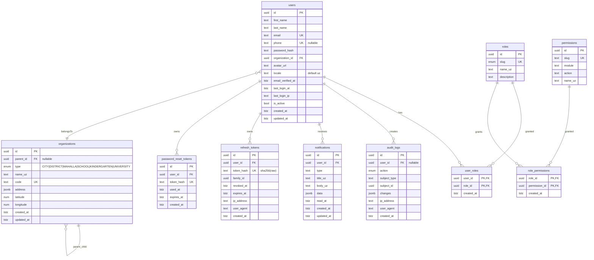

# Eco-Balance — Database schema (Phase 0)

PostgreSQL 16. All primary keys are UUIDv7 (time-ordered — index-friendly). Timestamps are
`timestamptz`. Deletions cascade to junction tables, `SET NULL` where the relation is
optional (audit logs keep pointing to a user id even after the user is deleted, etc.).

## ER diagram

## Indexes

Automatically created by Prisma:

| Table                   | Index                                           | Purpose                        |
|-------------------------|-------------------------------------------------|--------------------------------|
| users                   | (organization_id), (created_at DESC)            | list users per org             |
| organizations           | (parent_id), (type)                             | tree walk, filter by type      |
| audit_logs              | (user_id), (action), (subject_type, subject_id), (created_at DESC) | investigation queries |
| notifications           | (user_id, read_at), (created_at DESC)            | unread badge, feed             |
| refresh_tokens          | (user_id), (family_id), (expires_at)             | rotation & cleanup             |
| password_reset_tokens   | (user_id), (expires_at)                          | cleanup                        |

## Retention & cleanup

- **refresh_tokens**: scheduled job (Phase 2) deletes rows with `expires_at < now() - 30d`.
- **password_reset_tokens**: same, `expires_at < now() - 7d`.
- **audit_logs**: **never deleted** — mandatory for gov compliance.

## Enums

Prisma-native enums, mapped to PostgreSQL:

- `RoleSlug`: `SUPER_ADMIN`, `ADMIN`, `CITY_ADMIN`, `MAHALLA_MANAGER`, `TEACHER`, `STUDENT`, `CITIZEN`
- `OrganizationType`: `CITY`, `DISTRICT`, `MAHALLA`, `SCHOOL`, `KINDERGARTEN`, `UNIVERSITY`
- `AuditAction`: `CREATE`, `UPDATE`, `DELETE`, `LOGIN`, `LOGOUT`, `LOGIN_FAILED`, `PASSWORD_RESET_REQUEST`, `PASSWORD_RESET_COMPLETE`, `TOKEN_REFRESH`, `TOKEN_REVOKED`

## Post-Phase-0 additions (planned)

| Phase | New tables                                                                                  |
|-------|---------------------------------------------------------------------------------------------|
| 1     | (organizations CRUD only — schema already in place)                                          |
| 3     | `dashboard_widgets`, `kpi_snapshots`                                                         |
| 4     | `sensors`, `sensor_readings` (partitioned by month), PostGIS `geometry(Point, 4326)` columns  |
| 5     | `courses`, `lessons`, `enrollments`, `assignments`, `submissions`, `certificates`             |
| 6     | `points`, `badges`, `missions`, `mission_progress`, `leaderboards`                            |
| 7     | `ai_conversations`, `ai_messages`, `ai_prompts`                                               |
| 8     | `reports`, `report_runs`                                                                     |
| 9     | `news_posts`, `events`, `event_registrations`                                                |
